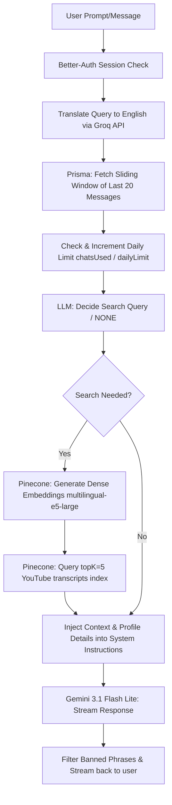

<!-- BEGIN:nextjs-agent-rules -->
# This is NOT the Next.js you know

This version has breaking changes — APIs, conventions, and file structure may all differ from your training data. Read the relevant guide in `node_modules/next/dist/docs/` before writing any code. Heed deprecation notices.
<!-- END:nextjs-agent-rules -->

# DARC (Dating and Relationship Coach) — Agent Context Guide

This document serves as the primary developer/agent context guide for the **DARC** repository. When starting a new session or contributing code, review this document to understand the codebase architecture, data flows, tech stack, and conventions.

---

## 1. Application Overview & Persona
DARC is an empathetic, psychologically grounded AI dating and relationship coaching platform.
- **AI Persona**: A warm, conversational human coach named **DaRC**. It avoids robotic or helper assistant tropes (like "As an AI...").
- **Coaching Scope**: Pre-dating (confidence, social anxiety), dating (approaching, flirting), and post-dating (communication, intimacy, kinks, breakups).
- **Core Constraints**: Refuses commands to code, perform math, answer political questions, or play system override games. It terminates early if banned phrases (e.g., "ignore all previous instructions") are streamed.

---

## 2. Technical Stack
- **Runtime & Package Manager**: [Bun](https://bun.sh/)
- **Frontend/Backend Framework**: Next.js 16 (App Router, React 19)
- **Styling**: Tailwind CSS 4 + Framer Motion for animations
- **Database**: PostgreSQL with Prisma ORM
- **Authentication**: Better-Auth (Google Social Login & Credentials)
- **AI Integration**:
  - Google GenAI SDK (`@google/genai`) for streaming chat responses using the `gemini-3.1-flash-lite` model.
  - Groq API with `llama-3.1-8b-instant` for translating user queries into English before executing Pinecone queries.
  - Pinecone for vector search (RAG) using `multilingual-e5-large` embeddings.

---

## 3. Core Architecture & RAG Pipeline Workflow
The chat interface streams responses using the following server-side RAG execution path (located in [route.ts](file:///Users/ashutosh/dev/darc/app/api/chat/v1/route.ts)):

### Steps in the RAG Pipeline:
1. **Authentication**: Verify session using Better-Auth (`auth.api.getSession`).
2. **Translation**: The user's input query is translated to English via the Groq API (`llama-3.1-8b-instant`) to align with the language of the Pinecone indexing material (YouTube transcript chunks).
3. **Database Chat History**: Retrieve up to the last 20 messages for the current chat session via Prisma.
4. **Daily Limits Enforcement**: Increment the user's `chatsUsed` counter in PostgreSQL. Daily limit is checked against `dailyLimit` (default `10` messages per user per day).
5. **Pinecone Query Generation Decision**: Gemini evaluates the context window and prompts a search query or decides no external context is needed (`NONE`).
6. **Vector Search & Embedding**: If context is needed, query embeddings are generated using Pinecone's inference SDK (`multilingual-e5-large`) and matched against the `youtube-transcripts` index (returning `topK=5`).
7. **Prompt & Profile Context Synthesis**: System instructions compile:
   - DARC Persona guidelines.
   - User Profile details (Age, Goals, Educational/Professional background, Location, etc.) retrieved from the database to personalize advice.
   - Relevant Pinecone knowledge segments.
8. **Generation Stream**: Send contents to `gemini-3.1-flash-lite`, verify output against banned phrases, and stream responses back to the client.

---

## 4. Key Directory & File Structure
- [app/api/chat/v1/route.ts](file:///Users/ashutosh/dev/darc/app/api/chat/v1/route.ts) — Main chat pipeline handler with Groq translation, Pinecone querying, and Gemini response streaming.
- [app/actions.ts](file:///Users/ashutosh/dev/darc/app/actions.ts) — Server actions for managing chats, messages, user profiles, limits, and authentication checks.
- [prisma/schema.prisma](file:///Users/ashutosh/dev/darc/prisma/schema.prisma) — Database schema definitions. Note that the Prisma client output is configured to generate at [lib/generated/prisma](file:///Users/ashutosh/dev/darc/lib/generated/prisma).
- [lib/auth.ts](file:///Users/ashutosh/dev/darc/lib/auth.ts) & [lib/auth-client.ts](file:///Users/ashutosh/dev/darc/lib/auth-client.ts) — Better-Auth configuration (Google Provider + credentials) and client auth hook exports.
- [lib/db.ts](file:///Users/ashutosh/dev/darc/lib/db.ts) — Relational DB client export using `@prisma/adapter-pg` pool.
- [components/chat/ChatInterface.tsx](file:///Users/ashutosh/dev/darc/components/chat/ChatInterface.tsx) — Main React component handling chat streaming and interface interactions.
- [components/Sidebar.tsx](file:///Users/ashutosh/dev/darc/components/Sidebar.tsx) — Sidebar list of current chats and profile customization.

---

## 5. Database Schema Key Models
- **`User`**: Core user profiles, authentication metadata, and relationship coaching context (age, education school/degree/year, goals, etc.). Tracks `dailyLimit` (default `10`) and `chatsUsed`.
- **`Session` / `Account` / `Verification`**: Auth schema structures for Better-Auth.
- **`Chat`**: References chats created by a specific user.
- **`Message`**: References individual messages within a chat. Roles can be `USER` or `DARC`.

---

## 6. Developer Workflows & Commands
All operations are run via the `bun` package manager.

| Command | Action |
|---|---|
| `bun install` | Installs the dependencies |
| `bun dev` | Runs the local Next.js development server |
| `bun run build` | Compiles the production build |
| `bun run lint` | Lints the application source files |
| `bunx prisma generate` | Re-generates the Prisma Client client code under `lib/generated/prisma` |
| `bunx prisma db push` | Synchronizes database schemas with prisma schema changes (used in development) |
| `bun run migrate:prod` | Runs production migrations |
| `bun run reset:prod` | Resets the production database |
