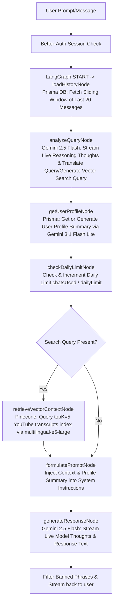

<!-- BEGIN:nextjs-agent-rules -->
# This is NOT the Next.js you know

This version has breaking changes — APIs, conventions, and file structure may all differ from your training data. Read the relevant guide in `node_modules/next/dist/docs/` before writing any code. Heed deprecation notices.
<!-- END:nextjs-agent-rules -->

# DARC (Dating and Relationship Coach) — Agent Context Guide & Developer Rules

This document serves as the primary developer/agent context guide for the **DARC** repository. When starting a new session or contributing code, review this document to understand the codebase architecture, data flows, tech stack, and conventions.

---

## ⚠️ CRITICAL RULES FOR ALL CODING AGENTS (READ BEFORE WORKING)

1. **NO HARDCODED MODEL NAMES**:
   - Never write raw string literals for model identifiers (e.g. `"gemini-2.5-flash"`, `"gemini-3.1-flash-lite"`, `"gemma-4-31b-it"`).
   - ALL model identifiers MUST be imported as centralized constants from [`lib/models.ts`](file:///Users/ashutosh/dev/darc/lib/models.ts) (e.g., `import { GEMINI_2_5_FLASH, GEMINI_3_1_FLASH_LITE } from "@/lib/models"`).

2. **USER-FRIENDLY STATUS EVENTS IN LANGGRAPH NODES**:
   - Omit reasoning token generation (`includeThoughts: false`) to minimize latency and token overhead.
   - Stream warm, natural, human-friendly status events (`Reading your message...`, `Checking coaching notes...`, `Writing a response for you...`) directly from backend LangGraph nodes to keep the user informed without developer jargon.

3. **PRISMA CLIENT LOCATION**:
   - The Prisma Client is configured to generate under [`lib/generated/prisma`](file:///Users/ashutosh/dev/darc/lib/generated/prisma). Always import database models and types from `@/lib/generated/prisma` or `@/lib/db`.

4. **DATABASE SCHEMA MIGRATION WORKFLOW**:
   - Whenever you need to change the DB schema, change it in [`prisma/schema.prisma`](file:///Users/ashutosh/dev/darc/prisma/schema.prisma).
   - Generate migration files for the change (`bunx prisma migrate dev`).
   - Generate the Prisma Client (`bunx prisma generate`).
   - Migrate the production database using the command specified in [`package.json`](file:///Users/ashutosh/dev/darc/package.json) (`bun run migrate:prod`).

---

## 1. Application Overview & Persona
DARC is an empathetic, psychologically grounded AI dating and relationship coaching platform.
- **AI Persona**: A warm, conversational human coach named **DaRC**. It avoids robotic or helper assistant tropes (like "As an AI...").
- **Coaching Scope**: Pre-dating (confidence, social anxiety), dating (approaching, flirting), and post-dating (communication, intimacy, kinks, breakups).
- **Core Constraints**: Refuses commands to code, perform math, answer political questions, or play system override games. It terminates early if banned phrases (e.g., "ignore all previous instructions") are streamed.

---

## 2. Technical Stack
- **Runtime & Package Manager**: [Bun](https://bun.sh/)
- **Frontend/Backend Framework**: Next.js 16 (App Router, React 19)
- **Styling**: Tailwind CSS 4 + Framer Motion for animations
- **Database**: PostgreSQL with Prisma ORM
- **Authentication**: Better-Auth (Google Social Login & Credentials)
- **AI Integration & LangGraph**:
  - LangGraph (`@langchain/langgraph`) for state machine execution in `app/api/chat/v2`.
  - Google GenAI SDK (`@google/genai`) for chat streaming, live thought extraction (`includeThoughts: true`), and context translation.
  - Model Architecture Constants exported in [`lib/models.ts`](file:///Users/ashutosh/dev/darc/lib/models.ts):
    - `GEMINI_2_5_FLASH` (`gemini-2.5-flash`) — Real-time reasoning thoughts streaming and response generation in LangGraph v2.
    - `GEMINI_3_1_FLASH_LITE` (`gemini-3.1-flash-lite`) — Lightweight response streaming and user profile summary synthesis.
    - `GEMMA_4_31B_IT` (`gemma-4-31b-it`) / `GEMMA_4_26B_IT` (`gemma-4-26b-it`) — Message translation & Pinecone RAG search query generation.
  - Pinecone for vector search (RAG) using `multilingual-e5-large` embeddings.

---

## 3. Core Architecture & LangGraph RAG Pipeline Workflow
The chat interface streams responses via the LangGraph state machine (located in [`app/api/chat/v2/route.ts`](file:///Users/ashutosh/dev/darc/app/api/chat/v2/route.ts) and [`app/api/chat/v2/graph.ts`](file:///Users/ashutosh/dev/darc/app/api/chat/v2/graph.ts)):

### Steps in the LangGraph Pipeline:
1. **Authentication**: Verify session using Better-Auth (`auth.api.getSession`).
2. **`loadHistoryNode`**: Retrieve up to the last 20 messages for the current chat session via Prisma.
3. **`analyzeQueryNode`**: User input and conversation history are analyzed with `GEMINI_2_5_FLASH` (`thinkingConfig: { includeThoughts: true }`). Live reasoning thoughts are streamed directly to status events, returning `englishMessage` and `searchQuery`.
4. **`getUserProfileNode`**: `getUserProfileContext(...)` checks if `profileSummary` exists in PostgreSQL. If missing, `GEMINI_3_1_FLASH_LITE` generates a structured profile summary and updates the database.
5. **`checkDailyLimitNode`**: Increment the user's `chatsUsed` counter in PostgreSQL. Daily limit is checked against `dailyLimit` (default `10` messages per user per day).
6. **`retrieveVectorContextNode`**: If `searchQuery` is generated, query embeddings are generated using Pinecone's inference SDK (`multilingual-e5-large`) and matched against the `youtube-transcripts` index (returning `topK=5`).
7. **`formulatePromptNode`**: System instructions compile DARC Persona guidelines, User Profile summary, and relevant Pinecone knowledge segments.
8. **`generateResponseNode`**: Stream response with `GEMINI_2_5_FLASH` (`includeThoughts: true`), streaming live reasoning thoughts and text chunks back to the client while filtering against banned phrases.

---

## 4. Key Directory & File Structure
- [app/api/chat/v2/route.ts](file:///Users/ashutosh/dev/darc/app/api/chat/v2/route.ts) — Next.js HTTP API route handler for LangGraph pipeline.
- [app/api/chat/v2/graph.ts](file:///Users/ashutosh/dev/darc/app/api/chat/v2/graph.ts) — LangGraph State Graph definitions, state annotations, nodes, conditional edges, and reasoning streaming execution.
- [app/api/chat/v2/langgraph.md](file:///Users/ashutosh/dev/darc/app/api/chat/v2/langgraph.md) — Comprehensive LangGraph architecture guide.
- [lib/models.ts](file:///Users/ashutosh/dev/darc/lib/models.ts) — Centralized export of AI model string constants (`GEMINI_2_5_FLASH`, `GEMINI_3_1_FLASH_LITE`, `GEMMA_4_31B_IT`, `GEMMA_4_26B_IT`).
- [lib/coaching.ts](file:///Users/ashutosh/dev/darc/lib/coaching.ts) — Persona system instructions, banned phrases, user profile context summary handler (`getUserProfileContext`).
- [lib/rag.ts](file:///Users/ashutosh/dev/darc/lib/rag.ts) — Pinecone dense vector embedding generation and index search logic.
- [lib/logger.ts](file:///Users/ashutosh/dev/darc/lib/logger.ts) — Non-production execution logger (`darc-execution.log`).
- [app/actions.ts](file:///Users/ashutosh/dev/darc/app/actions.ts) — Server actions for managing chats, messages, user profiles, limits, and authentication checks.
- [prisma/schema.prisma](file:///Users/ashutosh/dev/darc/prisma/schema.prisma) — Database schema definitions. Prisma client output generated at [lib/generated/prisma](file:///Users/ashutosh/dev/darc/lib/generated/prisma).
- [lib/auth.ts](file:///Users/ashutosh/dev/darc/lib/auth.ts) & [lib/auth-client.ts](file:///Users/ashutosh/dev/darc/lib/auth-client.ts) — Better-Auth configuration and client auth hooks.
- [lib/db.ts](file:///Users/ashutosh/dev/darc/lib/db.ts) — Relational DB client export using `@prisma/adapter-pg` pool.
- [components/chat/ChatInterface.tsx](file:///Users/ashutosh/dev/darc/components/chat/ChatInterface.tsx) — Main React component handling chat streaming and interface interactions.
- [components/Sidebar.tsx](file:///Users/ashutosh/dev/darc/components/Sidebar.tsx) — Sidebar list of current chats and profile customization.

---

## 5. Developer Workflows & Commands
All operations are run via the `bun` package manager.

| Command | Action |
|---|---|
| `bun install` | Installs the dependencies |
| `bun dev` | Runs the local Next.js development server |
| `bun run build` | Compiles the production build |
| `bun run lint` | Lints the application source files |
| `bunx prisma generate` | Re-generates the Prisma Client client code under `lib/generated/prisma` |
| `bunx prisma db push` | Synchronizes database schemas with prisma schema changes (used in development) |
| `bun run migrate:prod` | Runs production migrations |
| `bun run reset:prod` | Resets the production database |
