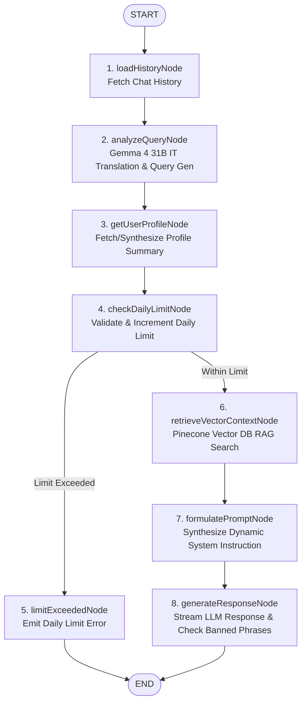

# DARC Chat API v2 — LangGraph Architecture Guide

This directory (`app/api/chat/v2`) contains the **LangGraph** implementation of the DARC relationship coaching pipeline.

---

## 1. Overview

The v2 pipeline replaces monolithic chat handling with a state-machine based workflow built on `@langchain/langgraph`. Each phase of context analysis, user profiling, rate limiting, RAG vector retrieval, prompt formulation, and response streaming is encapsulated into discrete, inspectable graph nodes with explicit conditional routing.

---

## 2. Graph State Schema (`GraphState`)

The state graph manages execution state using LangGraph's `Annotation.Root`:

```typescript
export const GraphState = Annotation.Root({
  userId: Annotation<string>,
  message: Annotation<string>,
  chatId: Annotation<string | undefined>,
  ai: Annotation<GoogleGenAI>,
  contents: Annotation<Array<{ role: string; parts: Array<{ text: string }> }>>,
  englishMessage: Annotation<string>,
  searchQuery: Annotation<string | null>,
  userProfile: Annotation<UserProfileData | null>,
  profileContext: Annotation<string>,
  retrievedContext: Annotation<string>,
  dynamicSystemInstruction: Annotation<string>,
  dailyLimitExceeded: Annotation<boolean>,
  dailyLimitError: Annotation<string | undefined>,
  error: Annotation<string | null>,
});
```

---

## 3. Visual Workflow (Mermaid Diagram)



---

## 4. Node Definitions & Responsibilities

| Node Name | Input State Required | Primary Action / Output State |
|---|---|---|
| `loadHistory` | `chatId`, `userId`, `message` | Fetches up to last 20 messages from Prisma DB and initializes `contents`. |
| `analyzeQuery` | `ai`, `contents` | Calls `processQueryAndGenerateSearchQuery` (Gemma 4 31B IT) to set `englishMessage` & `searchQuery`. Emits SSE status: `"Analyzing query & context"`. |
| `getUserProfile` | `userId`, `ai` | Queries `db.user.findUnique` and calls `getUserProfileContext` (Gemini 3.1 Flash Lite) to update `userProfile` and `profileContext`. |
| `checkDailyLimit` | `userId`, `userProfile` | Resets `chatsUsed` if new day; sets `dailyLimitExceeded = true` if limit reached, or increments `chatsUsed` in DB. |
| `limitExceeded` | `dailyLimitError` | Emits SSE error event when daily prompt limit is reached. |
| `retrieveVectorContext` | `searchQuery` | Queries Pinecone index using `multilingual-e5-large` dense embeddings if `searchQuery` exists. Emits SSE status: `"Retrieving coaching insights"`. |
| `formulatePrompt` | `profileContext`, `retrievedContext`, `contents` | Combines `SYSTEM_INSTRUCTION` + `profileContext` + `retrievedContext` into `dynamicSystemInstruction`. |
| `generateResponse` | `ai`, `contents`, `dynamicSystemInstruction` | Streams AI coach response via `ai.models.generateContentStream` with `BANNED_PHRASES` filtering. Emits SSE status: `"Formulating response"` and SSE text events. |

---

## 5. SSE Event Format

The API route `/api/chat/v2` streams server-sent events using `Content-Type: text/event-stream; charset=utf-8`:

- **Status Events**: `data: {"type":"status","message":"Analyzing query & context"}\n\n`
- **Text Stream Events**: `data: {"type":"text","content":"Hello! How can I help..."}\n\n`
- **Error Events**: `data: {"type":"error","error":"You have reached your daily limit..."}\n\n`

---

## 6. How to Use `/api/chat/v2` in Frontend

To point any component (such as `ChatInterface.tsx`) to the LangGraph v2 endpoint, simply change the fetch URL:

```typescript
const response = await fetch("/api/chat/v2", {
  method: "POST",
  headers: { "Content-Type": "application/json" },
  body: JSON.stringify({ message: content, chatId: activeChatId }),
});
```
