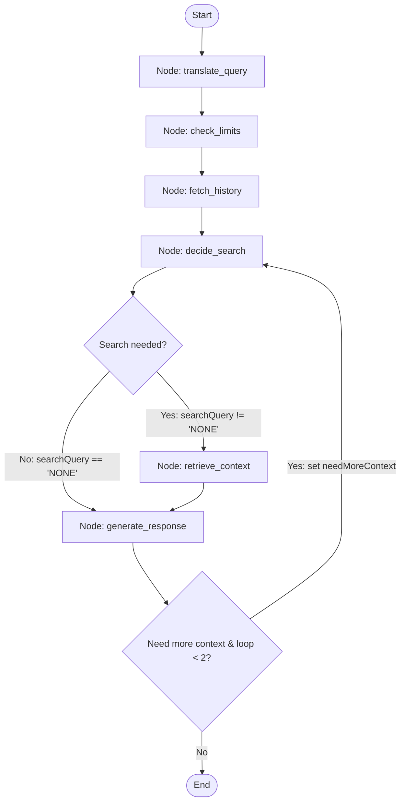

# DARC V2 LangGraph Architecture & Design Plan

This document details the transition of the **DARC** RAG pipeline from sequential TypeScript logic in `app/api/chat/v1/route.ts` to a structured, state-driven execution graph using **LangGraph.js**.

---

## 1. Graph State Definition (`ChatState`)
LangGraph relies on a shared state channel that is updated by nodes. We introduce cyclic tracking variables to support non-linear flow loops:

```typescript
import { Annotation } from "@langchain/langgraph";

export const ChatState = Annotation.Root({
  // --- Input Channels ---
  message: Annotation<string>(),         // Raw prompt sent by user
  chatId: Annotation<string | null>(),    // Active chat session ID (optional)
  userId: Annotation<string>(),          // Authenticated User ID from session
  
  // --- Intermediate Channels ---
  englishMessage: Annotation<string>(),  // Query translated to English
  history: Annotation<any[]>(),          // Chronological history of last 20 messages
  chatsUsed: Annotation<number>(),       // Daily prompts count
  dailyLimit: Annotation<number>(),      // Maximum allowed daily prompts
  searchQuery: Annotation<string | null>(), // Query derived by LLM for Pinecone query (or "NONE")
  context: Annotation<string>(),         // Relevant context retrieved from Pinecone index
  
  // --- Cyclic Routing Channels ---
  searchIterations: Annotation<number>(),// Counter to prevent infinite loops (max 2 loops)
  needMoreContext: Annotation<boolean>(),// Flag set by LLM if context is insufficient
  
  // --- Output Channels ---
  responseStream: Annotation<ReadableStream | null>(), // Stream response piped to client
  error: Annotation<string | null>(),    // Capture errors to terminate/report gracefully
});
```

---

## 2. Graph Nodes Reference
Each node performs a single, testable operational step, consuming state and returning state updates.

### Node A: `translate_query`
- **Responsibility**: Detect query language and translate to English via Groq API (`llama-3.1-8b-instant`).
- **Input**: `message`
- **Output**: `englishMessage`

### Node B: `check_limits`
- **Responsibility**: Check user daily usage parameters. Rollover daily stats if a new day, increment `chatsUsed`. Set error if limit is exceeded.
- **Input**: `userId`
- **Output**: `chatsUsed`, `dailyLimit`, `error`

### Node C: `fetch_history`
- **Responsibility**: Query Prisma to retrieve a sliding window of the last 20 messages for `chatId`.
- **Input**: `chatId`, `userId`
- **Output**: `history` (with the new message appended)

### Node D: `decide_search`
- **Responsibility**: Invoke `gemini-3.1-flash-lite` to formulate a Pinecone query or decide `NONE`. In cyclic loop states, this node takes the critique from the generator and formulates a refined, secondary query.
- **Input**: `history`, `englishMessage`, `searchIterations`
- **Output**: `searchQuery`

### Node E: `retrieve_context`
- **Responsibility**: Generate embeddings (`multilingual-e5-large`) and fetch top 5 relevant transcripts from Pinecone. If context already exists in the state from a prior loop, append the new results rather than overwriting.
- **Input**: `searchQuery`, `context`
- **Output**: `context` (updated/appended context string), `searchIterations` (incremented by 1)

### Node F: `generate_response`
- **Responsibility**: Evaluate if current context matches user specificity requirements. If context is lacking and `searchIterations < 2`, set `needMoreContext = true` to loop back. Otherwise, compile the system instructions and stream the final answer.
- **Input**: `history`, `context`, `userId`, `searchIterations`
- **Output**: `responseStream`, `needMoreContext`

---

## 3. Edges & Routing Workflow (Non-Linear Cycles)
The routing configuration allows the model to loop back to search for more information if the initial context retrieval is insufficient.



### Edge & Routing Logic:
1. **Linear Pipeline**: `__start__` ➔ `translate_query` ➔ `check_limits` ➔ `fetch_history` ➔ `decide_search`.
2. **Conditional search route**:
   - If `searchQuery !== 'NONE'` ➔ Route to `retrieve_context`.
   - If `searchQuery === 'NONE'` ➔ Route to `generate_response`.
3. **Loopback critique route (from `generate_response`)**:
   - If `needMoreContext === true` AND `searchIterations < 2` ➔ Loop back to `decide_search` to formulate a refined search query.
     > [!NOTE]
     > **Why route to `decide_search` instead of `retrieve_context` directly?**
     > If we went directly to `retrieve_context`, the graph would execute the vector search using the exact same `searchQuery` stored in the state, returning the same matching transcript documents and causing an infinite loop. Routing back to `decide_search` allows the LLM to inspect the current state (the conversation, what context has been retrieved so far, and why it is insufficient) and write a **new, more specific search query** to retrieve fresh, relevant documentation.
   - Otherwise ➔ Stream response and terminate via `__end__`.

---

## 4. Making Responses More "Human-Like" (Avoiding Chatbot Tropes)
To prevent the model from outputting robotic, formulaic, or uniform responses, make the following updates:

### A. Workflow & Parameter Adjustments
* **Dynamic Temperature**: Increase temperature from `1.0` to `1.15` and adjust `topP = 0.95`. This increases phrasing variety and prevents deterministic, safe "AI styling".
* **Dynamic Response Profiles**: Add a lightweight randomizer node or pre-prompt injector that assigns a dynamic "texting style" (e.g., *Style A: direct & short, Style B: introspective & conversational, Style C: blunt & friendly*) at the start of the graph. This prevents responses from having identical structures.

### B. System Prompt Guidelines (Persona Upgrades)
Inject the following strict rules into your `SYSTEM_INSTRUCTION` configuration:

1. **Ban AI Structuring Elements**:
   - **No nested lists or bullet points** by default (e.g., "1. Active listening, 2. Body language"). Humans do not text in bullet points. Use natural paragraph flow, commas, or simple transitions.
   - **No introductory outlines or summarizing conclusions** (e.g., "Here is some advice on...", "In summary...", "I hope this helps!"). Start directly with the raw thought and close conversationally.
2. **Emulate Natural Speech Patterns**:
   - Use ellipsis (`...`) to denote pauses in thought.
   - Use informal reactions at the beginning of responses where appropriate (e.g., *"Oh, man..."*, *"That is a tough spot"*, *"Huh, okay"*).
   - Use exclamation marks sparingly, and keep sentence lengths highly variable (some very short sentences, followed by a slightly longer conversational thought).
3. **Visual Signature Rule**:
   - Ensure the layout looks like a human text thread or a quick WhatsApp coach message. Avoid formatting walls of text with bold headers (`### 1. Focus on...`) unless the user explicitly asks for a structured guide.

---

## 5. Real-Time Background Status Updates (Streaming Protocol)
To let the user know what is happening in the background (translation, limit verification, database searches, retrieval), we move from a raw text stream to a **JSON Lines (JSONL)** streaming protocol.

### A. Protocol Payload Format
The server enqueues stringified JSON packets separated by newlines (`\n`). There are two packet types:
* **Status Updates**: Tells the UI what background step is running.
  ```json
  {"type": "status", "message": "Translating message..."}
  ```
* **Response Content**: Delivers the streamed tokens of the actual response.
  ```json
  {"type": "text", "chunk": "Hey"}
  ```

### B. Graph Event Streaming (Backend)
In the Route Handler, run the graph using `stream` mode to listen for node updates:
```typescript
const eventStream = await chatGraph.stream(inputs, { streamMode: "updates" });

for await (const [nodeName, nodeState] of eventStream) {
  // Map active node name to client status update (Coaching-centric, human-friendly style)
  let statusMessage = "";
  if (nodeName === "translate") statusMessage = "Listening...";
  if (nodeName === "check_limits") statusMessage = "Preparing coaching advice...";
  if (nodeName === "decide_search") statusMessage = "Reflecting on your relationship situation...";
  if (nodeName === "retrieve") statusMessage = "Recalling relationship insights...";
  
  if (statusMessage) {
    controller.enqueue(encoder.encode(JSON.stringify({ type: "status", message: statusMessage }) + "\n"));
  }
}
```

### C. Client Stream Consumer (Frontend)
Update the reader loop in `ChatInterface.tsx` to read line-by-line:
```typescript
const reader = response.body?.getReader();
const decoder = new TextDecoder();
let buffer = "";

while (true) {
  const { value, done } = await reader.read();
  if (done) break;

  buffer += decoder.decode(value, { stream: true });
  const lines = buffer.split("\n");
  buffer = lines.pop() || ""; // Save incomplete line for next chunk

  for (const line of lines) {
    if (!line.trim()) continue;
    const packet = JSON.parse(line) as { type: "status" | "text"; message?: string; chunk?: string };
    
    if (packet.type === "status") {
      setCoachStatus(packet.message); // Set state hook to show current pipeline status
    } else if (packet.type === "text") {
      setCoachStatus(null); // Clear status once output stream starts
      setMessages((prev) => appendTextToLastMessage(prev, packet.chunk));
    }
  }
}
```

---

## 6. Summary of Workflow Changes

| Parameter | V1 (Old) | V2 (New - LangGraph) |
| :--- | :--- | :--- |
| **Graph Structure** | Linear sequence (`route.ts`) | Stateful cyclic graph (`chatGraph.ts`) |
| **Search Logic** | Single-attempt Pinecone query | Double-pass refinement loop if context is missing |
| **Response Style** | Standard Markdown, often bulleted & bolded | Clean paragraph blocks, human quirks, dynamic styles |
| **Temperature / TopP** | `1.0` / `0.9` | `1.15` / `0.95` (increased variety) |
| **Streaming Style** | Raw plain text stream | JSON Lines (JSONL) status + text packet stream |
| **User Transparency** | Shows generic "typing..." loader | Shows human coaching phase (e.g. "Recalling relationship insights...") |

